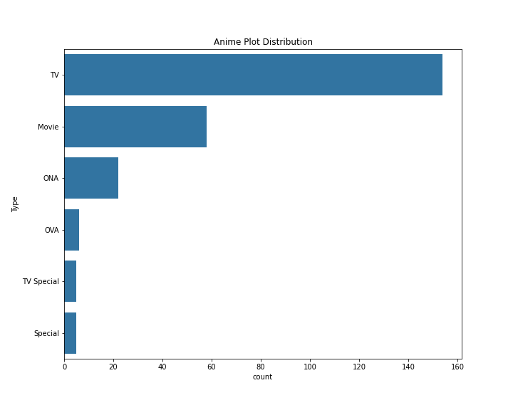

# Anime Dataset Analysis

Explore trends in anime scores, types, and top shows from MyAnimeList using Python and web scraping.

## 📦 Dataset
Scraped from: https://myanimelist.net/topanime.php (250 anime entries)

## 🧠 Overview
The goal of this project is to:
- Scrape the latest **Top 250 Anime** from [MyAnimeList](https://myanimelist.net/topanime.php)
- Clean and normalize the data (type, score, episodes, year)
- Save to **CSV**
- Perform **Exploratory Data Analysis (EDA)** with beautiful visualizations
- Share insights on anime types, ratings, and yearly trends

## 📌 Features Extracted
- **Title**
- **Score**
- **Episodes**
- **Aired Year**

## 🔍 Analysis Highlights
- Distribution of anime types (TV, Movie, OVA, etc.)
- Top-rated anime analysis
- Trends in scoring over the years

## 🛠 Tools Used
- Python, pandas, seaborn, BeautifulSoup
- Jupyter Notebooks
- GitHub for version control

## 📊 Visuals

## 📊 Key Analyses
- Distribution of anime by type
- Score distribution across types
- Episodes vs Score relationship
- Yearly trends in average anime scores
- Top 10 highest-rated anime